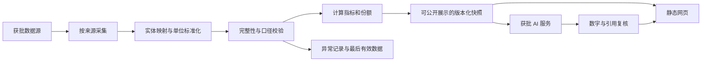

> 当前实施补充：用户已批准并实施 v0.2；逐项来源、采集与整站 PDF 方案见 [RELEASE_V2.md](RELEASE_V2.md)。下文保留此前基线与历史调研，最新时效以网站 `/sources` 为准。

> 实施状态：用户已于 2026-09-15 批准执行。实际架构与第一版数据边界见 [IMPLEMENTATION.md](IMPLEMENTATION.md)；以下保留原审批文档作为范围基线。

# Web3 市场数据中心 · 技术 Spec

版本：v0.1｜状态：方案草案，待用户确认｜文档日期：2026-09-15（取样于 9 月 14 日夜间）

关联：[PRD](PRD.md)、[数据源总表](DATA_SOURCES.md)、[原站审计](research/origin-data-audit.md)、[DEX / Hyperliquid 审计](research/dex-hyperliquid-audit.md)、[插件审计](research/plugin-options-audit.md)。

## 1. 设计目标与边界

交付公开数据网页及 GitHub 项目。第一版采用静态展示与定时数据生产分离的架构，网页读取经过校验的版本化快照，源接口故障不直接影响页面打开。当前仅编写文档，以下目录、程序、工作流和配置均尚未创建。

业务范围以 PRD 的 OV-01、CX-01～06、DX-01～02、TK-01～03、HL-01 为准。保留原有内部视图；期权、网站流量、UNI Burn 不出现在导航、计算、图表、默认数据请求或 AI 输入中。其他未获批模块不引入。

不通过浏览器自动操作作为生产采集的常规依赖，不调用私人交易账户、持仓或交易 API。生产源选择与来源替换均须记录，不能自动切到不等价指标。

## 2. 推荐技术架构（未安装）

| 层 | 建议 | 选择原因与边界 |
| --- | --- | --- |
| 前端 | React + TypeScript，Vite 静态构建 | 适合多路由看板和静态部署；具体稳定版本在实施时锁定 |
| 图表 | Apache ECharts | 份额、趋势、堆叠和多系列图；无需生成图片素材 |
| 采集与处理 | Node.js LTS + TypeScript | 与前端共享指标定义和校验类型 |
| 快照 | JSON / NDJSON；按源、日期、指标组织 | 第一版不增加数据库服务；跨运行持久化见第3.1节，不能依赖临时runner目录 |
| 调度 | GitHub Actions 定时任务 + 手动重跑 | 与 GitHub 项目一起维护；免费额度及账户类型先确认 |
| 托管 | 推荐 Cloudflare Pages 免费额度 | 静态文件通过 CDN 分发；需要用户批准创建 / 连接该服务 |
| AI | 独立可关闭的生成适配器 | 模型服务未定；没有服务时按 D-03 处理 |

版本号、软件依赖与锁文件在批准开发后确定。所有供应商密钥只放批准的云端秘密存储中，不放前端构建变量或浏览器；现有会话插件的授权不复制到生产环境。

GitHub 用于项目管理与代码交付，不默认承担数据公开分发。网站公开与仓库公开是两个独立决策。



生产采集可以通过服务器只读 HTTP 获取数据；浏览器只读取本站快照，不直连第三方 API，避免密钥泄露、浏览器跨域和访问量放大调用额度。

## 3. 计划中的项目结构

```text
docs/
  PRD.md
  SPEC.md
  DATA_SOURCES.md
  research/
src/
  app/                 路由与页面布局
  components/          卡片、图表、明细、来源说明、状态组件
  pages/               CEX、DEX、代币化股票、Hyperliquid
  domain/              实体类型、指标契约、时间和单位
  data/                已发布快照读取器
config/
  sources.yaml         来源与使用条件
  content-manifest.yaml 内容基线与组件分母
  entities.yaml        平台、协议、基础资产及产品映射
  metrics.yaml         指标定义、单位、窗口、校验规则
pipeline/
  adapters/            每个获批来源一个适配器
  normalize/           时间、单位、身份映射
  calculate/           份额、变化、费率、价差
  validate/            校验和发布门槛
  publish/             快照与站点产物
data/
  published/           仅可对外展示的最小数据集，是否进 Git 另确认
tests/
  fixtures/            自有合成测试样本，明确标识，不用于网页
  domain/              计算与状态测试
.github/workflows/     构建、定时更新、手动恢复（均待创建）
README.md
.env.example           只列变量名称和说明，不含实际值
```

原始响应在获批的私有工作目录或受限存储中处理；不默认写入公共仓库、公开构建产物或可公开下载的工作流附件。第一版数据量较小时优先不用额外存储服务；超出边界后再讨论迁移。

### 3.1 跨运行持久化与恢复（D-06 待确认）

推荐把允许留存的标准化历史、最后有效指标组、修订记录、AI最后有效文本及发布清单，保存到**私有 GitHub 状态存储**，使用正常的版本提交实现小规模持久化：

- 如果项目仓库选择私有，可在同一私有仓库的 `data-state` 分支维护状态。
- 如果代码仓库公开，需要另行批准一个私有状态仓库及最小读写凭据；GitHub 不能用“私有分支”在公共仓库内隐藏数据。未批准此方案前，跨日生产更新仍属待配置。
- runner 每次读取已知状态版本，验证校验和，再在临时目录进行增量处理；成功接受的数据组提交为新状态版本。记录 `last_accepted_snapshot` 与 `last_published_snapshot` 两个独立指针，发布失败不推进后者。
- 下一次运行或手动恢复从状态版本读取，而不是依赖 Actions cache、短期附件或上一台 runner 的磁盘。历史不随暂时失败清空。
- 原始响应优先只在内存 / 临时目录中解析；持久留存只限来源允许且确有必要的标准化数据。公开产物仅包含发布所需的最小子集。
- 私有仓库额度、增长上限和维护权限在D-06落实；暂定每月检查体积。数据规模超出小型Git状态存储适用范围时提交迁移方案，不自行增加付费对象存储。

此设计不会默认创建第二个仓库；仓库归属、可见性及存储选择必须在实施前明确。

## 4. 内容基线与实现率契约

每个路由、内部视图和关键数据组件登记以下属性：

```text
component_id, parent_route_id, original_page_url,
original_label, proposed_label, approval_status,
component_type, metric_ids, entity_scope,
required_filters, priority, counted_metric_family,
implementation_status, data_readiness, blocking_reason
```

`approval_status` 区分用户明确要求、原有内容保留、建议待确认。新增 DEX 市场份额属于用户明确要求；现货 / 永续拆分方案仍由 D-01 决定。

页面完成率与数据组件覆盖率分别计算。一个组件计为数据完成必须同时满足：真实数据、字段及单位通过校验、日期可解释、来源可追溯、公开使用核验通过、生产运行环境验证通过。空状态完成不算数据完成。

同一 metric family 的重复摘要不重复计数。关键组件清单固定后才计算 ≥80% 目标，不能用减少分母掩盖缺口。每次发布输出按专题的完成清单、缺口及原因。

## 5. 来源登记与适配器接口

### 5.1 SourceRegistry

每个来源至少登记：

| 字段 | 含义 |
| --- | --- |
| `source_id`, `provider`, `endpoint`, `docs_url` | 标识、实际供应商、公开入口和文档 |
| `auth_mode`, `secret_name` | 无鉴权 / API key 等；只有变量名 |
| `technical_status` | sample_verified / documented / unverified / failed |
| `semantic_status` | verified / partial / pending |
| `public_display_status` | confirmed / pending / restricted |
| `snapshot_distribution_status` | 公开JSON或其他机器可读派生快照的分发状态；与仅网页展示分开 |
| `raw_redistribution_status` | 原始数据公开分发状态，与网页展示分开 |
| `usage_evidence_url`, `reviewed_at` | 使用范围核验依据与日期 |
| `cadence`, `source_timezone`, `history_limit` | 发布节奏、时区、历史限制 |
| `calls_per_run`, `daily_budget`, `monthly_budget` | 免费调用预算；超限不升级付费 |
| `coverage_definition`, `attribution` | 覆盖范围与展示来源方式 |
| `fallback_source_id`, `fallback_approved` | 只有已核验等价且用户批准的备用源才可切换 |

同一接口目录名不等于真实上游归属；例如原站 URL 含 `coinglass` 不能直接当成数据归属证明。原站聚合接口与其实际上游分别登记。

静态网页可读取的JSON是公开数据产物，即使未添加下载按钮也可能被机器取得。发布门槛必须覆盖这种实际交付方式；仅确认网页显示权不足时，该源不能进入公开快照，也不能通过去掉下载按钮规避限制。

### 5.2 AdapterResult

适配器负责只读请求和解析，返回标准化结果及质量信息，不直接生成页面：

```ts
type AdapterResult = {
  sourceId: string;
  fetchedAt: string;                 // UTC ISO 8601
  sourceUpdatedAt: string | null;     // 没有则 null，禁止用 fetchedAt 代填
  schemaVersion: string;
  observations: Observation[];
  warnings: string[];
  requestedCoverage: string;
  returnedCoverage: string;
  isPartial: boolean;
};
```

实际网络、限流、状态码及时间另记运行日志。日志不能打印认证头、token、用户凭据或整包可能含敏感信息的响应。

## 6. 实体与观测数据契约

### 6.1 实体层

平台类型：`cex / dex_spot / dex_perp / chain / issuer / data_aggregate`。平台品牌、协议父级、协议版本、链、市场 / 交易对分层建模。

产品类型：`native_stock / tokenized_equity / wrapped_token / spot_crypto / perpetual / futures / stablecoin / other`。合约地址使用 `(chain_id, contract_address)`；交易市场使用 `(venue_id, source_market_id)`；不得仅靠名称或 ticker 合并。

保留 `underlying_id / issuer_id / contract_multiplier / quote_currency / settlement_currency / market_status`。原站 CEX 集合若含 Hyperliquid，标签保留真实类型，不能把它错标成 CEX 或自行移出统计集合而不说明。

### 6.2 Observation

```ts
type Observation = {
  metricId: string;
  sourceId: string;
  entityId: string;
  marketId: string | null;
  chainId: string | null;
  categoryId: string | null;
  marketType: string;
  value: number | null;
  unit: string;                     // USD、BTC、ETH、contracts、ratio、count
  rawValue: string | number | null;
  rawUnit: string | null;
  windowType: "instant" | "rolling" | "calendar";
  windowStart: string | null;
  windowEnd: string | null;
  observedAt: string | null;
  sourceUpdatedAt: string | null;
  fetchedAt: string;
  grain: string;                    // snapshot、15m、1h、4h、1d、1w、1mo 等
  isComplete: boolean | null;
  coverageId: string;
  quality: "valid" | "missing" | "suspect";
  reason: string | null;
  calculationVersion: string;
};
```

没有源时间的当前快照允许记录为“采集时取得的快照”，但不能声称其 `observedAt = fetchedAt`。缺少逐点时间的插件数组只用作参考趋势，不进入正式时序计算。

历史幂等键完整包含 `sourceId / metricId / entityId / marketId / chainId / categoryId / marketType / windowType / windowStart / windowEnd / observedAt / grain / coverageId / calculationVersion`。空维度使用固定null表示，不丢弃；避免全链与单链、不同分类或覆盖集合相互覆盖。无源时点的即时快照另以采集批次标识，不能伪装成精确历史时点。历史修订保留 revision，不悄悄改写过去结论。比较期缺数时输出 null。

### 6.3 PublishedSnapshot

发布清单包含 `snapshot_id / schema_version / built_at / last_run_at / data_as_of_by_metric / source_versions / files / checksums / coverage_summary`。各页读取同一 `snapshot_id`，不会卡片用新数据、表格用旧数据。

`built_at` 只表示站点产物生成时间，`last_run_at` 表示任务实际运行时间。数据日期从每条观测获得。源数据混合日期在组件旁标明，禁止只显示一个“今日更新”覆盖全部指标。

## 7. 计算规范

### 7.1 DEX 份额

默认建议：同一来源、同一 UTC 完整日、同一市场类型的协议历史 breakdown；7d / 30d 使用截止该日的连续完整日窗口。滚动 24h 如另提供，明确命名并独立计算，不与“昨日”混用。

设 `v(p,d)` 为协议 p 在日期 d 的成交额。冻结实体映射后，选择互不重叠的协议集合 `U(d)`：

```text
covered_volume(d) = Σ v(p,d), p ∈ U(d)
share(p,d) = v(p,d) / covered_volume(d)
volume_7d(p,d) = Σ v(p,k), k ∈ [d-6,d]
share_7d(p,d) = volume_7d(p,d) / Σ volume_7d(q,d)
share_change_pp = 100 × (share_now - share_previous)
```

关键规则：

1. 父协议和子版本不同时相加；保留源定义和版本映射。多链全量与单链子记录不同时相加。
2. 一致的期间、集合与链筛选同时作用于分子分母；聚合器路由量不混入执行场所量。
3. `coverage_id` 变化时标明覆盖变化；无法重建共同可比集合时不发布份额变化。
4. 分母 <=0 或不足时不计算。缺失协议不是 0；其他份额只来自实际有值的剩余协议。7d / 30d 正式窗口要求每个入选协议在窗口每一天均有已确认值（来源确认的真实0可接受）；不跳过缺日报后把6天量标成7天。缺报协议从该完整窗口集合中排除并披露，或将整窗标partial并暂停正式份额；所选策略在来源验收固定。跨期变化使用两个窗口都完整的共同协议集合，否则不输出可比变化。
5. 来源顶层 `total24h`、逐协议 `total24h` 合计、历史某一天总量必须先对账。不同则作为不同口径保存，不强行归一化后称为原站 / 全球份额。
6. 最新日历日期可能为未完成日。以日期、来源发布时延和完整性标记共同判断，默认回退到最近完整且通过校验的日。
7. 推荐 Top 10 + 其他、份额堆叠历史和完整排行表。无逐协议历史时禁用历史份额图，按接入日积累。

本轮发现 DefiLlama 顶层 24h、协议合计和昨日图表总量并不相等；因此以上对账是上线必须通过的真实问题检查，见审计记录。现货份额方法不能用在永续数据上而不单独核验。

### 7.2 CEX 成交及对比

按市场类型和 UTC 日分别聚合；源是滚动窗口则保留滚动含义。份额分母为明确收录平台集合，排除 `ALL / Total` 总计行与重复记录。

样本平台成交额与全市场报告总额都可保留，但不能让前者分子除以后者而不解释覆盖差异。原站出现“有效成交”等文案时，只有已核实清洗方法才沿用该含义，否则显示源定义说明并提交名称决策。

7d 变化区分单日值相较 7 天前、连续 7 天合计相较前 7 天，不能只用一个含混的“7d”标签。月度汇总与日度序列对账；未完成月份明确为月内累计。

### 7.3 OI 与资金费率

OI 按源文档识别 native units、contracts 或 USD。只有单位为原生币数量且价格在同一时点时：`oi_usd = oi_native × price_usd`；合约张数必须另乘合约面值。反向合约依据平台规格转换。

资金费率内部保留小数形式和 `interval_hours / settlement_at / weighting_method`。`0.0001` 在百分比展示为 `0.01%`，只转换一次。

历史结算费率可按实际结算事件求某期间累计；预测费率与已结算费率分别存储。聚合时使用同一期间、同一标的且同一时点的权重；无权重不伪造加权结果。

交易对和聚合视图的 Z-Score 均进入内容清单。计算需确认原序列、回看窗口、采样频率、均值与标准差定义、缺值策略及最小样本数；未确认前保留指标待接入。不得任选30天参数冒充原站Z-Score；标准差为0或样本不足时输出null。

简单年化参考仅在间隔明确时使用 `rate × (24 / interval_hours) × 365`，显示为静态年化估计；不得宣称可获得收益。费率套利需同标的、可比期间和平台数据，交易成本与可执行性缺失时不输出收益保证。

### 7.4 储备与人工研究内容

保存 `assets / clean_assets / inflows` 等实际字段，各自独立。储备估值上涨可能由价格引起，不能自动解释为净充值或用户增长。

原站“储备可信度”包含作者自定义研究权重和手工评分，不作为免费 API 客观数据复制。保留该视图位置并列 D-08 决策；未批准规则、输入及来源前不生成新评分，也不搬用作者研究文案。

### 7.5 TradFi / 股票代币与价差

原热门板块若为 TradFi 永续分类，按其实际产品类型呈现；不得将永续名义成交额写成链上股票代币现货成交。额外加入 xStocks / Ondo 等发行方市场属于候选扩展，须用户确认。

原页面指数溢价：`(mark_price - index_price) / index_price`；其含义不同于相对底层股票现货溢价。

只有产品、币种、乘数、交易时段、报价时间满足既定可比规则时，才计算跨平台价差。若有同步 bid / ask，可报告 `(bid_sell - ask_buy) / ask_buy` 的报价价差；费用、深度、借贷、转移和结算能力未计入时，不命名为净套利利润。

若只取得 last / mark price，明确属于参考价差。若价格时间无法证实或产品类型不同，则质量状态为 suspect，不展示异常大数为机会。

### 7.6 Hyperliquid

官方 `metaAndAssetCtxs` 按返回顺序与同响应的 universe 配对；校验长度与身份，不能跨请求按索引硬拼。保留下架 / 暂停状态，返回记录数不是活跃交易对数。

默认 dex 与 HIP-3 命名 dex 分别获取与标识；遗漏某 dex 时给出 coverage，不把默认市场量描述为平台总量。`dayNtlVlm`、`openInterest`、`markPx`、funding 根据官方定义单独规范化。

原站费用、分类、市场、资产、HIP-4、HyperEVM DEX 的日度历史需逐视图接通；官方当前快照不能替代所有 Dune / ASXN 历史。没有历史 OI 时只从接入后积累，不用价格 K 线重建过去 OI。

### 7.7 稳定币与链上专题

稳定币的币种总量和链分布可能是同一总量的两个分解视角，不相加。区分流通数量与美元市值，不能统一假设所有稳定币永远为 1 USD。存储供应商映射和跨链处理方式。

Robinhood 的每日交易、活跃地址、新增 / 回访、DEX、Launchpad 和 RWA 依赖各自查询及字段。交易笔数与 token transfer 不混用，地址不去推断真实人数。查询结果日期、执行日期和数据索引延迟分别保存。

## 8. AI 解读技术要求

生成输入为通过公开使用与质量校验的紧凑事实表，包含 metric_id、值、单位、比较期、日期、来源链接及 coverage。只使用本版范围；不给模型账户密钥或原始私有数据。

输出要求：`summary / observations[] / metric_refs[] / data_as_of / generated_at / model_id / prompt_version / snapshot_id`。每条观察都能指回事实表；带数字的句子须与输入核对。异常值、缺失比较期、来源滞后不得产生肯定结论。

只在有效快照变化时生成；设置每日调用次数、输入输出长度和月度费用上限。免费额度不足即停止，不自动升级。无已批准模型服务时保留待接入；模板模式需按 D-03 明确命名。

AI 失败保留上一有效版本并显示其日期；不能因为网页更新就改写解读的生成时间。网页将输出按纯文本 / 安全 Markdown 渲染，源文本不能注入脚本或改变系统规则。

## 9. 日更工作流

### 9.1 推荐调度

建议北京时间 09:17 主检查，13:47 补偿检查。后一任务检查主任务的实际结果，仅补采失败源或尚未发布的数据；全部幂等。支持维护者手动重跑。审批前不保存调度配置。

GitHub Actions 的 schedule 可能延迟或丢弃任务，且公共仓库长期无活动时可能停用定时任务，因此不能承诺秒级准点或绝对无中断。两次检查降低单次错过风险，网页按实际时间提示过期，并配合运行记录检查。[官方调度说明](https://docs.github.com/en/actions/reference/workflows-and-actions/events-that-trigger-workflows#schedule)

若业务要求强于尽力日更，另评估独立调度；不能悄悄增加新服务或费用。

### 9.2 一次运行

1. 锁定 manifest、实体映射与计算版本，获取运行锁。
2. 根据免费预算、源发布节奏和上次成功点确定请求集合。
3. 并行读取相互独立来源；每源限速，遇 429 遵循 Retry-After；暂定最多 3 次退避重试。
4. 规范化与质量校验，错误数据隔离；成功但未更新与失败分开记录。
5. 重算受影响的指标族。比较图或份额的关联数据成组校验，避免部分更新破坏分母。
6. 生成候选发布快照；失败指标组沿用最后有效版本并标注日期。
7. 可选 AI 生成与数字验证；AI 失败不阻塞已有效的基础数据发布。
8. 构建网站与快照；通过校验后一次切换版本，不逐文件覆盖生产。
9. 验证公开 URL 返回新版本与来源日期；记录成功、缺项、失败和实际检查时间。

当全部源失败，仍需记录本次检查失败；页面继续显示上次数据，客户端用真实日期计算过期状态。失败记录本身不能被算成成功数据更新。

### 9.3 历史与恢复

首次只回填来源允许、业务需要且经过采样核验的历史。原站已有多年数据不代表需要将全量都放入网页；默认展示近 30 / 90 / 180 天等已获批窗口，历史按需加载。无法回填的指标从接入日积累。

保存最近有效版本以供回滚；同批次同一时间窗重复采集不重复累计。保留校验原因和修订记录。发布失败保留旧站，不用旧数据生成“已成功更新”的新时间。

## 10. 状态机与页面行为

| 数据条件 | 显示 | 计算 / 解读 |
| --- | --- | --- |
| 未配置或未获准来源 | 待接入 | 不计算、不生成 |
| 请求成功但目标窗口无值 | 数据暂缺 / 上游未发布 | 不补 0；保留已知历史 |
| 当前值有效且符合源节奏 | 正常值 + 数据日期 | 允许计算 |
| 源延迟或采集失败且有历史 | 最后有效值 + 更新延迟 | 对时效敏感的比较暂停 |
| 单位、身份或总量不一致 | 数据异常 / 口径待核验 | 隔离异常指标 |
| 仅历史有效 | 历史图 + 截止日期 | 不冒充当前市场 |

新鲜度阈值按来源配置。日度来源可先建议数据结束后 36 小时预警、72 小时严重延迟；慢发布来源使用自己的预期周期；这些阈值在源验收时确认。站点检查时间超过 26 小时另提示任务未及时检查，与源数据滞后独立。

## 11. 前端、性能与交互验收

- 路由与视图对应 PRD，深链可以直接打开；静态托管配置 SPA fallback 或等价路由输出。
- 摘要、图表、表格使用同一数据模型；筛选变化同步更新相关分子和分母。
- 数值格式固定单位、有效精度和千分位；null 显示“—”及状态，0 是有效数字。
- 主图按需加载；不要把所有交易对多年分钟数据打包进首页。
- 源说明位于具体组件附近或可展开说明中，包含指标含义、日期与覆盖范围。
- 可键盘操作；读屏有标签；对比度、200% 文本放大和移动端表格可用。
- 参考测试视口：1440px、1024px、390px；检查长中文、负数、很大金额和暂缺状态。
- 建议上线目标：Lighthouse 桌面性能 ≥90、移动性能 ≥80、无障碍 ≥90；记录测试条件与实际分数，不能以分数代替人工阅读检查。
- 不引入访问追踪、登录、订阅、钱包连接、交易操作、新闻流或批量数据导出等未请求功能。

## 12. 必须验证的业务测试

| 测试 | 应得到的结果 |
| --- | --- |
| 父协议、子协议和多链记录同时存在 | 只按批准的互斥集合计算一次 |
| DEX 顶层总量与协议合计不相等 | 阻止混用分母，记录差异 |
| 某协议在比较期缺值 | 不把缺值当 0；份额变化按可比性规则处理 |
| 当日未结束 / 上游尚未发布 | 不作为完整日默认值 |
| rate=0.0001，8h | 展示0.01%；静态简单年化10.95%，不称收益 |
| OI=2 BTC，价格=50,000 USD | 在原生币单位确认后为100,000 USD；若2是合约张数则不能直接这样算 |
| 同 ticker 的股票、代币、永续 | 保持不同实体，不计算未经批准的价差 |
| mark 与 index 价差 | 不标成底层股票现货溢价 |
| 请求失败、重跑、响应修订 | 最后有效数据保留、无重复累计、修订可追踪 |
| AI 引用缺失指标或错误数字 | 拒绝该解读，保留上一有效版本 |
| 删除项 | 所有页面与快照不含网站流量、期权或UNI Burn功能 |
| 公开发布 | 只含已核验允许的字段，无密钥或未准许的原始数据 |

使用小型自有测试样本验证计算，而不是对网页造假数据。集成样本另记录来源；核心指标至少与源样本对账一次。实际跨日观察与手动回放单独报告。

## 13. GitHub、托管与维护交付

批准后才创建 / 连接远程仓库。创建前确认 owner、repo、可见性及代码许可。当前本地目录只有现存 Git 初始化和本轮文档，不提交、推送或改远程。

推荐 GitHub Actions 负责采集、校验和构建，Cloudflare Pages 负责公开静态展示。选择受限的仓库连接或部署凭据；具体授权方式在部署选择确定后落实，不能假设聊天工具授权就是云端部署身份。

若用 `GITHUB_TOKEN` 提交数据，不依赖该提交自动触发另一条 Actions 发布工作流；在同一获批流程中完成后续构建 / 部署，或采用明确验证过的触发机制。[GitHub 工作流触发说明](https://docs.github.com/en/actions/how-tos/writing-workflows/choosing-when-your-workflow-runs/triggering-a-workflow)

GitHub 公共仓库标准 runner 的运行时间有免费政策；私有仓库及日志 / 附件额度依计划而定。Cloudflare Pages 免费计划目前列每月 500 次构建；本案每天至多两次常规构建约 60 次/月，但开发构建、重试、数据服务与 AI 费用另算。上线前重新核对并设置不自动超额消费的预算策略。[GitHub 计费](https://docs.github.com/en/billing/concepts/product-billing/github-actions)、[Pages 限额](https://developers.cloudflare.com/pages/platform/limits/)

GitHub Pages 可作为静态项目展示候选，但其用途限制与业务网站适配需要确认，不因已有 GitHub 仓库就默认选择。Sites 也可作为已有工具中的托管候选；是否支持本项目持续调度和完整 GitHub 交付需在实施阶段验证。本版不同时接入多个托管平台。[GitHub Pages 限制](https://docs.github.com/en/enterprise-cloud%40latest/pages/getting-started-with-github-pages/github-pages-limits)

最终 README 应解释：本地运行、数据更新、来源与限制、环境变量名、新增或修改指标的流程、常见失败恢复、费用边界、发布和回滚，以及如何阅读实现率清单。提供公开 URL、GitHub URL、版本号、已接通组件和仍缺项；未达到每日实际运行验证时明确说明。

## 14. 实施前决策与变更规则

沿用 PRD 的 D-01～D-09。没有答复的项目保持“待确认”，不会因等待时间经过而自动变成批准。

新增插件、注册 API 服务、取得 key、购买套餐、增加收费模型、改变指标定义、删减内部视图、扩大市场覆盖、改变公开数据分发方式或发布到新的目的地，都先形成具体变更说明再确认。已明确批准的普通实现细节按本文执行，不反复要求逐项许可。
